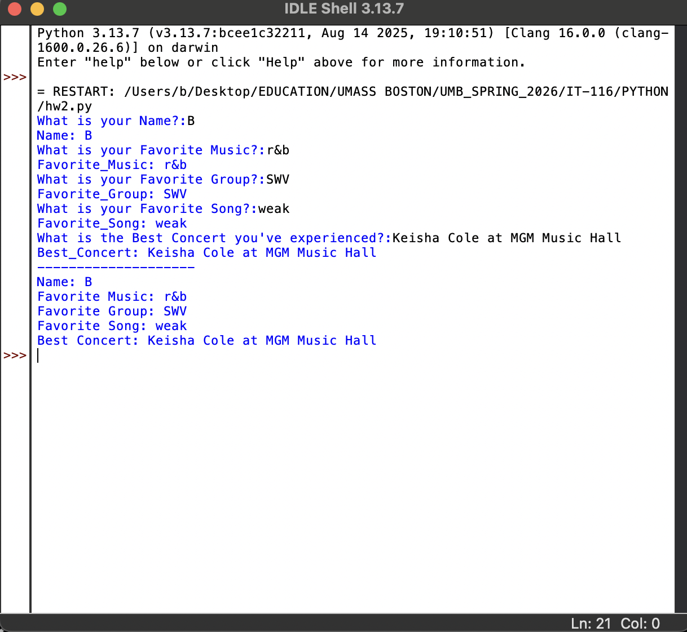

# IT-116 Scripting Progress 🐍

This folder contains my foundational Python scripts and demonstrates basic input/output operations and variable management in Python, using IDLE environment. 

## 🛠️ SKILLS DEMONSTRATED
- **User Input:** Handling real-time data entry via the `input()` function.
- **Variable Management:** Data storage using descriptive naming conventions.
- **Formatting:** String concatenation and standardized output formatting.
- **Debugging:** Troubleshooting common `NameError` expectations during the development process.

## 📂 Featured Assignment: User Interaction & Data Storage (hw2.py)
  - In this assignment, I practiced capturing user input and storing it in variables to create a personalized summary report.

### **Key Concepts Applied:** 
- **Variable Assignment:** Storing strings like `Name` and `Favorite_Music`.
  
- **Input Handling:** Using the `input()` function to pause script execution for user interaction.
  
- **Visual Organization:** Using a divider `print("-" * 20)` to separate the input phase from the final report for better readability. 
  
- **Output Standardization:** Implementing a summary report to ensure data is presented clearly to the end user. 

### **Code Preview**

Example of my hw2.py logic

```python
# 1. Ask for name and store it in "name"
Name = input("What is your Name?:")

# 2. Print "Name and the value of 'Name'
print("Name:", Name)

# 3. Repeating step above for "Music"
Favorite_Music = input("What is your Favorite Music?:")

# 4. Print "music and the value of 'Favorite_Music'
print("Favorite_Music:", Favorite_Music)

print("-" * 20) # Just a divider to make it look clean
print("Name:", Name)
print("Favorite Music:", Favorite_Music)
```

### **Execution Output**


# 🧠 Reflection on Learning 
- While working on this script, I focused on the programmatic flow. I learned that how you ask for data (the "prompt") is just as important as how you display it. By adding a divider to distinguish the "Input Phase" from the "Report Phase," I am practicing a fundamental step in creating  professional, user-friendly terminal applications. 

---
[⬅ Back to Main Repository](https://github.com/Bnerj/UMB-IT-Coursework/tree/main)
